# 📊 Projet de pilotage commercial & Data Quality — Power BI

Projet de Business Intelligence réalisé avec **Power BI, PostgreSQL, Power Query (M), DAX et SQL** afin de construire un outil de pilotage de la performance commerciale et de contrôle de la qualité des données.

L’objectif est de transformer plusieurs sources commerciales en un modèle analytique structuré permettant de suivre le chiffre d’affaires, la marge, les objectifs commerciaux et les performances par région, catégorie, client et commercial.

---

## 🎯 Objectifs du projet

Le projet répond à plusieurs besoins métier :

- suivre le **CA net**, la marge et le taux de marge ;
- comparer les performances aux **objectifs commerciaux** ;
- analyser les résultats par **commercial, région, catégorie et client** ;
- suivre l’évolution du CA dans le temps ;
- accéder au détail d’un commercial via un **drill-through** ;
- détecter les anomalies de référentiel et mesurer la **conformité des données** ;
- proposer une expérience interactive avec filtres, paramètres de champs et tooltips ;
- contrôler les performances des visuels et des requêtes DAX ;
- appliquer un **Row-Level Security (RLS) dynamique** pour simuler des droits d’accès différents.

---

## 🎬 Démonstration interactive

### Dashboard Power BI

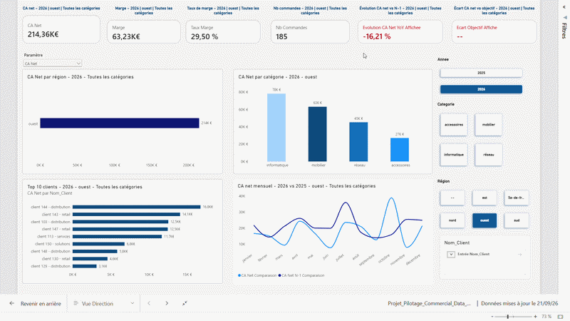

La démonstration montre notamment :

- les filtres interactifs ;
- le changement dynamique de KPI ;
- les mises à jour des graphiques ;
- le tooltip commercial ;
- le drill-through vers la page de détail.

### Row-Level Security (RLS)

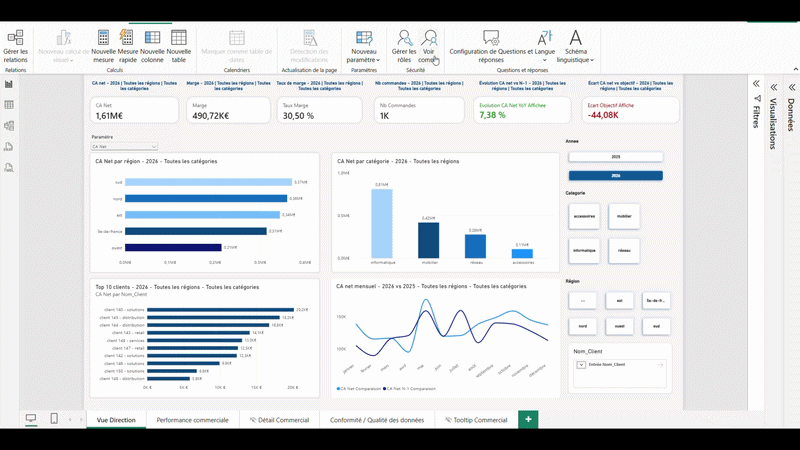

Cette démonstration illustre le comportement du rapport selon l’utilisateur simulé dans Power BI Desktop.

---

# 📈 Dashboard

## 1. Vue Direction

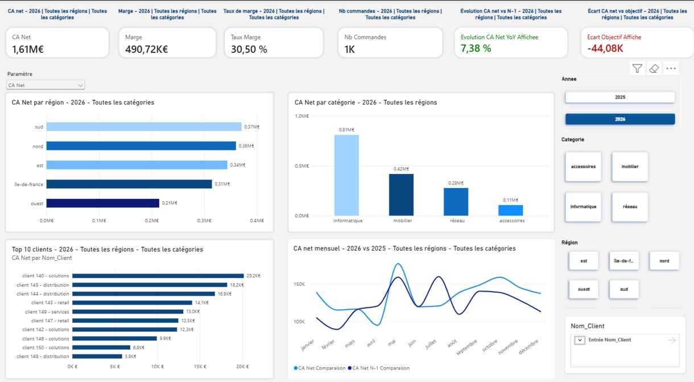

Vue synthétique destinée au pilotage global de l’activité.

Principaux indicateurs :

- CA Net ;
- Marge ;
- Taux de marge ;
- Nombre de commandes ;
- Évolution du CA Net vs N-1 ;
- Écart CA Net vs objectif.

Analyses disponibles :

- performance par région ;
- performance par catégorie ;
- Top 10 clients ;
- évolution mensuelle ;
- sélection dynamique du KPI affiché.

Le paramètre de champ permet de choisir entre :

`CA Net` • `Marge` • `Nb Commandes` • `Panier Moyen`

---

## 2. Performance commerciale

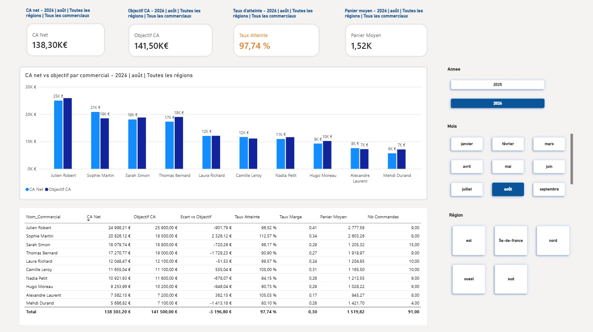

Cette page permet de comparer la performance des commerciaux à leurs objectifs.

Indicateurs suivis :

- CA Net ;
- Objectif CA ;
- Taux d’atteinte ;
- Écart vs objectif ;
- Panier moyen ;
- Taux de marge ;
- Nombre de commandes.

---

## 3. Détail commercial — Drill-through

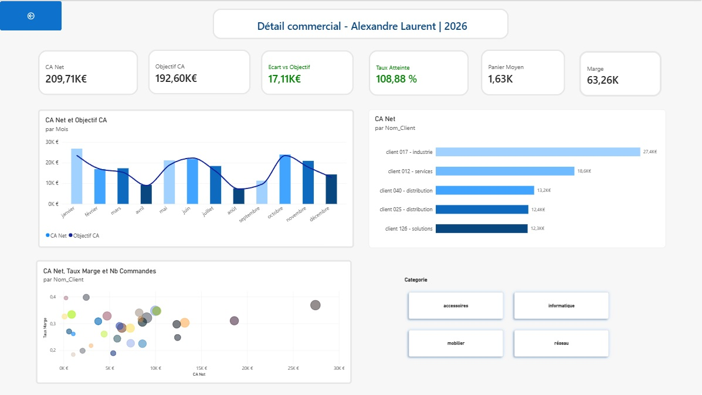

Une page de **drill-through** permet d’accéder au détail d’un commercial sélectionné depuis la page Performance commerciale.

Elle présente notamment :

- CA réalisé ;
- objectif ;
- écart à l’objectif ;
- taux d’atteinte ;
- marge ;
- panier moyen ;
- évolution mensuelle ;
- analyse par client.

Cette page est masquée de la navigation principale et accessible depuis le contexte d’un commercial.

---

## 4. Conformité & qualité des données

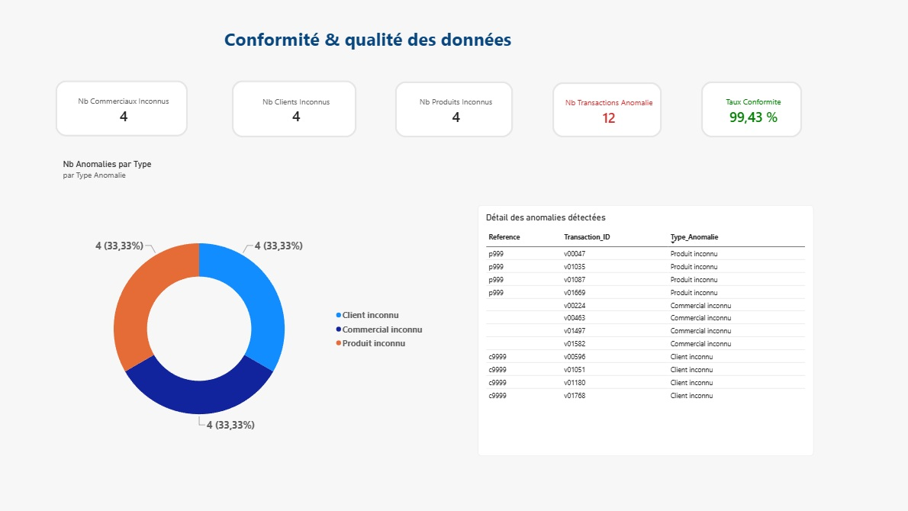

Le projet intègre des contrôles dédiés à la qualité des données.

Contrôles réalisés :

- clients inconnus ;
- produits inconnus ;
- commerciaux inconnus ;
- transactions présentant une anomalie ;
- taux global de conformité.

Des requêtes de détail permettent d’identifier les enregistrements concernés.

---

## 5. Tooltip commercial personnalisé

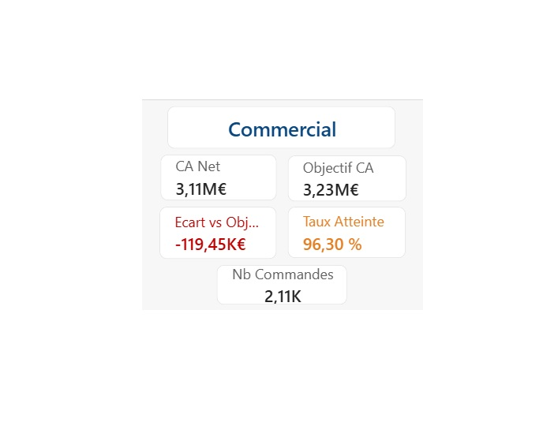

Un tooltip personnalisé affiche des informations complémentaires lors du survol d’un commercial, notamment :

- CA Net ;
- objectif ;
- écart vs objectif ;
- taux d’atteinte ;
- nombre de commandes.

---

# 🗄️ Architecture des données

Les fichiers sources sont disponibles dans les dossiers `excel/` et `csv/`.

Les données ont ensuite été intégrées dans une base **PostgreSQL** locale, dans la base :

`powerbi_commercial`

avec un schéma `raw`.

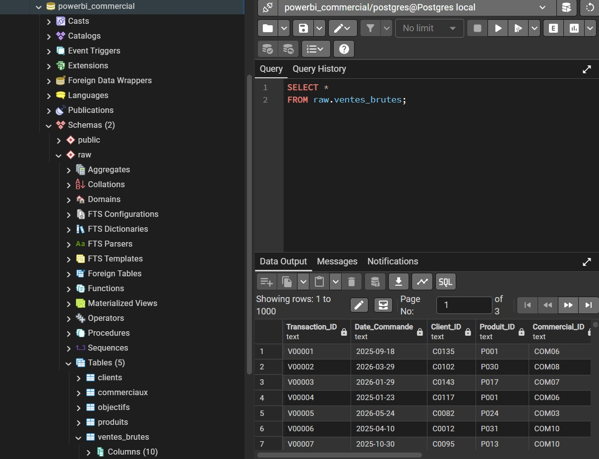

Tables principales :

```text
raw.clients
raw.commerciaux
raw.objectifs
raw.produits
raw.ventes_brutes
```

Architecture générale :

```text
Fichiers Excel / CSV
        │
        ▼
PostgreSQL
powerbi_commercial
        │
        └── schema raw
            ├── clients
            ├── commerciaux
            ├── objectifs
            ├── produits
            └── ventes_brutes
        │
        ▼
Power Query / M
        │
        ▼
Modèle en étoile Power BI
        │
        ▼
Mesures DAX
        │
        ▼
Dashboard + Data Quality + RLS
```

---

# 🔄 Power Query / Langage M

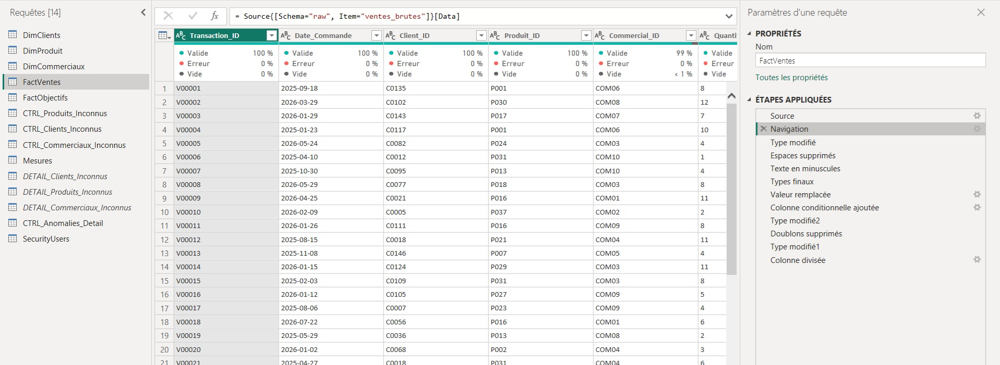

Power Query est utilisé pour préparer les données avant leur chargement dans le modèle.

Exemples de traitements :

- connexion à PostgreSQL ;
- nettoyage des espaces ;
- normalisation des valeurs texte ;
- conversion des dates ;
- conversion des champs numériques ;
- normalisation des remises ;
- traitement des valeurs nulles ;
- création de contrôles ;
- suppression des doublons ;
- préparation des dimensions et tables de faits.

Exemple de connexion PostgreSQL en langage M :

```powerquery
Source =
    PostgreSQL.Database(
        "localhost:5432",
        "powerbi_commercial"
    )
```

Navigation vers la table de ventes brutes :

```powerquery
Source{[Schema="raw", Item="ventes_brutes"]}[Data]
```

---

# 🧩 Modèle de données

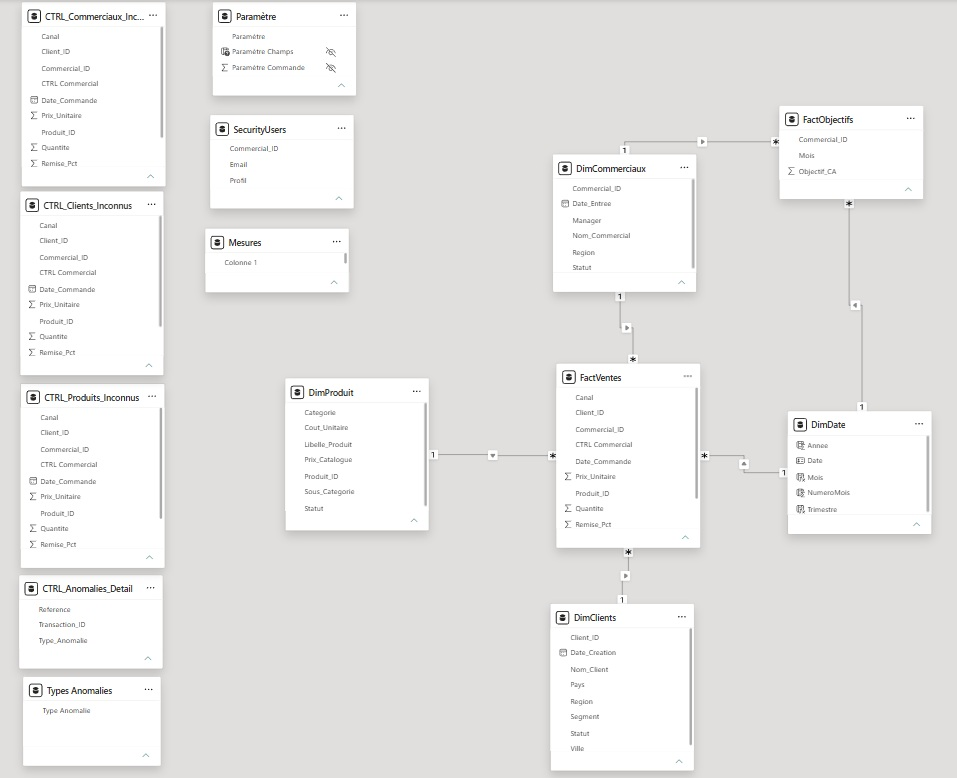

Le modèle est organisé selon une logique de **schéma en étoile**.

### Dimensions

- `DimClients`
- `DimProduit`
- `DimCommerciaux`
- `DimDate`

### Tables de faits

- `FactVentes`
- `FactObjectifs`

Les dimensions filtrent les tables de faits via des relations `1 → *`.

`DimDate` est générée directement dans Power Query.

---

# 🧮 DAX

Les indicateurs du dashboard sont calculés avec des mesures DAX.

Exemples :

- CA brut ;
- CA net ;
- marge ;
- taux de marge ;
- panier moyen ;
- nombre de commandes ;
- objectif CA ;
- écart vs objectif ;
- taux d’atteinte ;
- évolution du CA vs N-1.

DAX est également utilisé pour :

- les titres dynamiques ;
- les couleurs conditionnelles ;
- les contextes de filtres ;
- les KPI Data Quality ;
- la logique de RLS dynamique.

---

# 🔐 Row-Level Security (RLS)

Le rapport intègre un **RLS dynamique** afin de simuler plusieurs niveaux d’accès.

Principe de démonstration :

- un commercial voit uniquement les données associées à son identifiant ;
- un manager peut disposer d’une vue étendue selon la règle de sécurité définie ;
- l’utilisateur est simulé dans Power BI Desktop via **Afficher comme / View as**.

La démonstration est disponible ici :


---

# ⚙️ Fonctionnalités Power BI utilisées

- modèle en étoile ;
- PostgreSQL comme source de données ;
- Power Query / langage M ;
- mesures DAX ;
- paramètres de champs ;
- titres dynamiques ;
- filtres et slicers ;
- tooltip personnalisé ;
- drill-through ;
- mise en forme conditionnelle ;
- contrôles de qualité des données ;
- Row-Level Security dynamique ;
- analyse des performances des visuels.

---

# 🚀 Analyse des performances

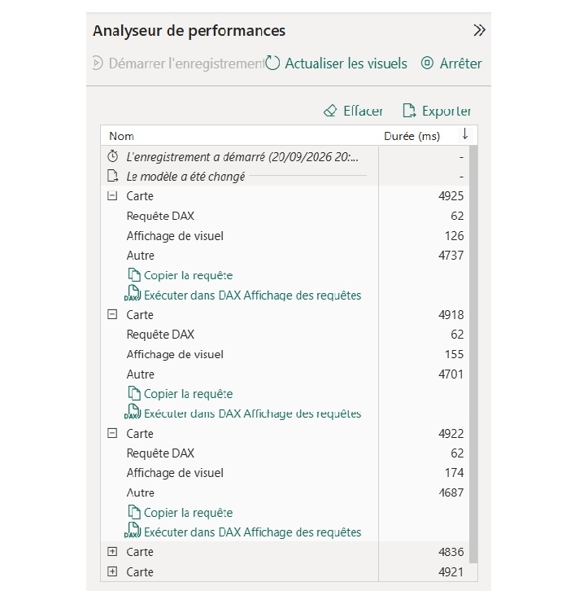

Le **Performance Analyzer** de Power BI a été utilisé pour observer le temps d’exécution des visuels.

L’analyse permet notamment de distinguer :

- le temps d’exécution DAX ;
- le temps d’affichage du visuel ;
- les autres traitements internes Power BI.

Cette étape permet d’identifier les axes d’optimisation avant publication.

---

# 🛠️ Stack technique

| Domaine | Technologies |
|---|---|
| Business Intelligence | Power BI Desktop |
| Base de données | PostgreSQL |
| Administration BDD | pgAdmin |
| Transformation | Power Query / M |
| Analyse | DAX |
| Requêtes | SQL |
| Sources initiales | Excel / CSV |
| Versioning / Portfolio | Git / GitHub |

---

# 📁 Structure du dépôt

```text
Power_BI/
│
├── README.md
├── Projet_Pilotage_Commercial_Data_Quality.pbix
│
├── csv/
│   ├── 01_Clients.csv
│   ├── 02_Produits.csv
│   ├── 03_Commerciaux.csv
│   ├── 04_Ventes_Brutes.csv
│   └── 05_Objectifs_Commerciaux.csv
│
├── excel/
│   ├── 01_Clients.xlsx
│   ├── 02_Produits.xlsx
│   ├── 03_Commerciaux.xlsx
│   ├── 04_Ventes_Brutes.xlsx
│   └── 05_Objectifs_Commerciaux.xlsx
│
├── gif/
│   ├── Demo_Projet_Pilotage_Commercial_Data_Quality.gif
│   └── Demo_RLS.gif
│
└── screenshot/
    ├── 01_vue_direction.jpg
    ├── 02_vue_performance_commerciale.jpg
    ├── 03_vue_detail_commercial_drill_through.jpg
    ├── 04_vue_qualite_conformite.jpg
    ├── 05_commericla_tooltip.jpg
    ├── 06_analyseur_performance.jpg
    ├── 07_postgres.jpg
    ├── 08_modele_powerbi.jpg
    └── 09_factventes_power_query.jpg
```

---

# 🔍 Chaîne de traitement

```text
Sources Excel / CSV
      ↓
PostgreSQL / schéma raw
      ↓
Nettoyage et transformations Power Query
      ↓
Dimensions + tables de faits
      ↓
Modèle en étoile
      ↓
Mesures DAX
      ↓
Data Quality + RLS
      ↓
Reporting Power BI
      ↓
Analyse des performances
```

---

# 💡 Compétences mises en œuvre

### Data ingestion
- intégration de plusieurs sources ;
- chargement dans PostgreSQL ;
- manipulation SQL.

### Data preparation
- nettoyage ;
- standardisation ;
- typage ;
- gestion des valeurs nulles ;
- traitement des anomalies ;
- contrôles de qualité.

### Data modeling
- dimensions ;
- tables de faits ;
- relations ;
- schéma en étoile.

### Analytics
- KPI ;
- comparaison réalisé / objectif ;
- analyse temporelle ;
- segmentation commerciale.

### Data visualization
- dashboard interactif ;
- paramètres de champs ;
- slicers ;
- drill-through ;
- tooltip personnalisé ;
- titres dynamiques.

### Security & performance
- RLS dynamique ;
- simulation d’utilisateurs ;
- Performance Analyzer ;
- analyse des temps DAX et de rendu.

---

# 🔜 Évolutions possibles

- publication et exploitation complète dans Power BI Service ;
- actualisation planifiée ;
- configuration d’une gateway pour une base PostgreSQL locale ;
- ajout de vues SQL dédiées au reporting ;
- montée en volume des données ;
- automatisation du pipeline d’alimentation.

---

## 👤 Auteur

**Thibaut Longchamps**

Data Analyst / Data & AI

GitHub : [Thibaut-Longchamps](https://github.com/Thibaut-Longchamps)
